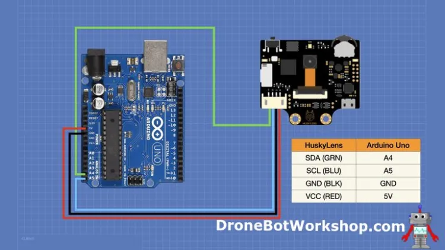

# Color-Based-Control-With-HuskyLens

## Introduction
HuskyLens is an AI-powered vision sensor that can recognize faces, objects, colors, lines, and more using built-in machine learning algorithms. It’s beginner-friendly and easy to integrate with microcontrollers like Arduino or Raspberry Pi.

In this project, we’ll use the Color Recognition feature of the HuskyLens to control three different LEDs based on detected colors (green, blue, and white).

---

## Project Idea

The goal is to control colored LEDs using color detection. When the HuskyLens detects a specific color, the Arduino will light up the corresponding LED:
- Green color → Green LED
- Blue color → Blue LED
- White color → White LED

---

## Components Needed
- HuskyLens AI Camera
- Arduino Uno (or similar)
- 3 LEDs (Green, Blue, White)
- 3 Resistors (220Ω)
- Jumper Wires
- Breadboard
- Power supply (or USB cable)

---

## Required Library

You’ll need the HuskyLens Arduino Library.

###  How to Install the Library:

#### Method 1: From Arduino IDE
1. Go to Sketch > Include Library > Manage Libraries...
2. Search for HuskyLens
3. Click "Install"

#### Method 2: Manual Installation
1. You and Download the library from this link:  
   [Download HuskyLens Library](https://wiki.dfrobot.com/HUSKYLENS_V1.0_SKU_SEN0305_SEN0336#4.%20Upgrade%20Firmware)
2. Extract the ZIP file
3. Move the folder to: Documents/Arduino/libraries

---

##  HuskyLens to Arduino Wiring

| HuskyLens Pin | Arduino Pin |
|---------------|-------------|
| VCC           | 5V          |
| GND           | GND         |
| TX            | A4 (SDA)    |
| RX            | A5 (SCL)    |

> 💡 Note: The default communication protocol is I2C. Make sure you're using the correct pins depending on your Arduino board (for Uno: A4 = SDA, A5 = SCL).

---
## Wiring Diagram

##  Important Notes
- Make sure HuskyLens is set to Color Recognition mode from its onboard menu.
- Train the HuskyLens to recognize each color separately (green, blue, white), and make sure each one has a unique ID (e.g., green = ID1, blue = ID2, white = ID3).
- Double-check your LED connections and resistors.

---

