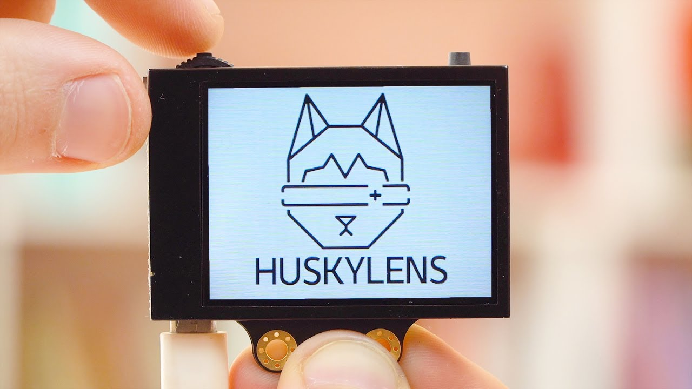

# HuskyLens With arduinoo

## Introduction
### 1. What is HuskyLens?
HuskyLens is an AI vision sensor that can detect and recognize faces, objects, colors, lines, and tags using built-in machine learning. It’s easy to use and integrates with Arduino, Raspberry Pi, and other microcontrollers via I2C or UART. It also features a built-in display for real-time visual feedback.

### 2. Features
-  **Color Recognition** – Detects and identifies trained colors.
-  **Face Recognition** – Learns and recognizes human faces.
-  **Object Recognition** – Identifies custom trained objects.
-  **Object Classification** – Categorizes items into classes.
-  **Object Tracking** – Follows moving objects automatically.
-  **Line Tracking** – Tracks lines for robotics applications.
-  **Tag Recognition (AprilTag)** – Reads visual markers like tags and IDs.

### 3. Applications

- Robotics and smart vehicle navigation  
- Face-based entry or security systems  
- Color-triggered lighting or actions  
- Vision-based object interaction  
- Educational AI learning kits  
- IoT systems with visual input

###  4. How to Install the Library:
#### Method 1: From Arduino IDE
1. Go to Sketch > Include Library > Manage Libraries...
2. Search for HuskyLens
3. Click "Install"

#### Method 2: Manual Installation
1. You and Download the library from this link:  
   [Download HuskyLens Library](https://wiki.dfrobot.com/HUSKYLENS_V1.0_SKU_SEN0305_SEN0336#4.%20Upgrade%20Firmware)
2. Extract the ZIP file
3. Move the folder to: Documents/Arduino/libraries

##  5. HuskyLens to Arduino Wiring

| HuskyLens Pin | Arduino Pin |
|---------------|-------------|
| VCC           | 5V          |
| GND           | GND         |
| TX            | A4 (SDA)    |
| RX            | A5 (SCL)    |

> 💡 Note: The default communication protocol is I2C. Make sure you're using the correct pins depending on your Arduino board (for Uno: A4 = SDA, A5 = SCL).

## 6. Wiring Diagram

