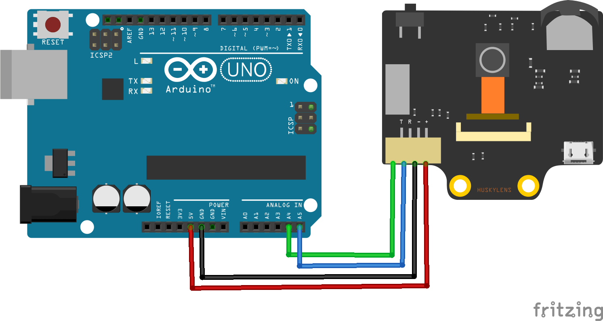

# HuskyLens With arduinoo

## Introduction
HuskyLens is an AI-powered vision sensor that can recognize faces, objects, colors, lines, and more using built-in machine learning algorithms. It’s beginner-friendly and easy to integrate with microcontrollers like Arduino or Raspberry Pi.

## Project Idea

The goal is to control the color of a single RGB LED using color detection. When the HuskyLens detects a specific color, the Arduino will light up the corresponding color in the RGB LED:
- Red color → Red light
- Green color → Green light
- Blue color → Blue light

## Components Needed

- HuskyLens AI Camera
- Arduino Uno (or similar)
- 1 RGB LED (Common Anode)
- 3 Resistors (220Ω)
- Jumper Wires
- Breadboard
- USB Cable (for power and programming)
  

## Required Library

You’ll need the HuskyLens Arduino Library.

###  How to Install the Library:

#### Method 1: From Arduino IDE
1. Go to Sketch > Include Library > Manage Libraries...
2. Search for HuskyLens
3. Click "Install"

#### Method 2: Manual Installation
1. You and Download the library from this link:  
   [Download HuskyLens Library](https://wiki.dfrobot.com/HUSKYLENS_V1.0_SKU_SEN0305_SEN0336#4.%20Upgrade%20Firmware)
2. Extract the ZIP file
3. Move the folder to: Documents/Arduino/libraries

---

##  HuskyLens to Arduino Wiring

| HuskyLens Pin | Arduino Pin |
|---------------|-------------|
| VCC           | 5V          |
| GND           | GND         |
| TX            | A4 (SDA)    |
| RX            | A5 (SCL)    |

> 💡 Note: The default communication protocol is I2C. Make sure you're using the correct pins depending on your Arduino board (for Uno: A4 = SDA, A5 = SCL).

---
## Wiring Diagram

