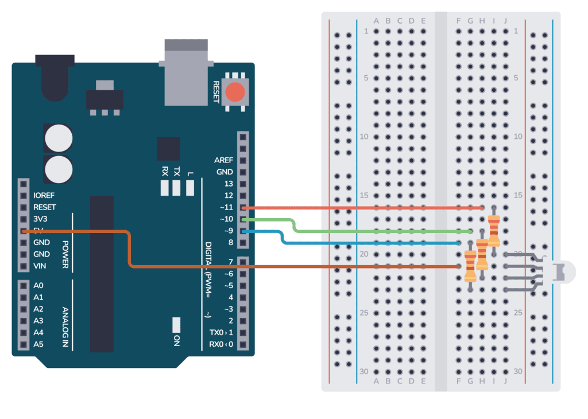

# HuskyLens With RGB LED 

## Project Idea

The goal is to control the color of a single RGB LED using color detection. When the HuskyLens detects a specific color, the Arduino will light up the corresponding color in the RGB LED:
- Red color → Red light
- Green color → Green light
- Blue color → Blue light

---

## Components Needed

- HuskyLens AI Camera
- Arduino Uno (or similar)
- 1 RGB LED (Common Anode)
- 3 Resistors (220Ω)
- Jumper Wires
- Breadboard
- USB Cable (for power and programming)

---

## What is HuskyLens?

HuskyLens is an AI vision sensor that can detect and recognize faces, objects, colors, lines, and tags using built-in machine learning. It’s easy to use and integrates with Arduino, Raspberry Pi, and other microcontrollers via I2C or UART. It also features a built-in display for real-time visual feedback.

---

## Features

- **Color Recognition** – Detects and identifies trained colors.
- **Face Recognition** – Learns and recognizes human faces.
- **Object Recognition** – Identifies custom trained objects.
- **Object Classification** – Categorizes items into classes.
- **Object Tracking** – Follows moving objects automatically.
- **Line Tracking** – Tracks lines for robotics applications.
- **Tag Recognition (AprilTag)** – Reads visual markers like tags and IDs.

---

## Applications

- Robotics and smart vehicle navigation  
- Face-based entry or security systems  
- Color-triggered lighting or actions  
- Vision-based object interaction  
- Educational AI learning kits  
- IoT systems with visual input

---

## RGB LED Overview

An RGB LED combines Red, Green, and Blue LEDs in one package, allowing you to create various colors by mixing these three basic colors.

### How It Works

- Each color pin (Red, Green, Blue) connects to Arduino pins via 220Ω resistors.  
- For a **Common Anode** RGB LED, the common pin is connected to 5V.  
- The LED colors turn on when the corresponding Arduino pin is set to **LOW**.  
- By adjusting the brightness of each color using PWM (`analogWrite`), you can create a wide range of colors.
https://github.com/Asayl01/huskylens-rgb-led/issues/1#issue-3227079415

For more details and to explore RGB color values, visit:  
[W3Schools RGB Colors Guide](https://www.w3schools.com/colors/colors_rgb.asp)

### Wiring to Arduino

---

## How to Install the HuskyLens Library

### Method 1: From Arduino IDE

1. Go to **Sketch > Include Library > Manage Libraries...**  
2. Search for **HuskyLens**  
3. Click **Install**

### Method 2: Manual Installation

1. Download the library from this link:  
   [Download HuskyLens Library](https://wiki.dfrobot.com/HUSKYLENS_V1.0_SKU_SEN0305_SEN0336#4.%20Upgrade%20Firmware)  
2. Extract the ZIP file  
3. Move the folder to: `Documents/Arduino/libraries`

---

## HuskyLens to Arduino Wiring

| HuskyLens Pin | Arduino Pin |
|---------------|-------------|
| VCC           | 5V          |
| GND           | GND         |
| TX            | A4 (SDA)    |
| RX            | A5 (SCL)    |

> _Note: The default communication protocol is I2C. For Arduino Uno, use A4 (SDA) and A5 (SCL)._

---

## Wiring Diagram

